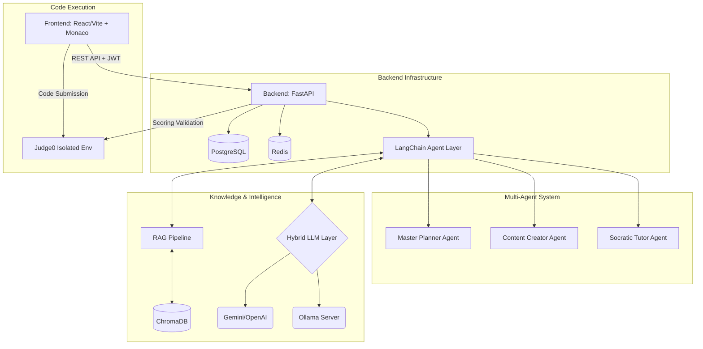

# Larry: AI Coding Coaching Platform

**Version:** 1.0.0-Baseline (t0)

Larry is a next-generation, web-based AI Coding Coaching platform. Designed from scratch using a Multi-Agent System (MAS) and Retrieval-Augmented Generation (RAG), Larry provides users with personalized learning journeys, dynamic curriculum generation, and an isolated, real-time code execution environment. 

This document serves as the official baseline (t0) architecture and project documentation.

---

## 🏗 Architecture Overview

The system is designed with a modern decoupled architecture, separating the client interface from the backend API, the AI orchestration layer, and the isolated code evaluation environment.




### 1. Hybrid LLM Architecture
Larry uses a cost-effective and highly capable hybrid model strategy:
- **Commercial APIs (e.g., Gemini Pro):** Utilized by the Master Planner Agent for complex reasoning, long-term journey generation, and high-level curriculum design.
- **Local Open Source Models (e.g., Llama 3 via Ollama):** Run locally via Docker to handle high-volume interactions like the Socratic Tutor and repetitive Content Creation tasks, dramatically reducing API costs.

### 2. Multi-Agent System (LangChain)
- **Master Planner:** Analyzes user prompts to generate a structural `Journey` with specific `objectives` spanning multiple days.
- **Content Creator:** Generates the theoretical content and curates specific coding `Tasks` (problems) for a `DailyPlan`.
- **Socratic Tutor:** Acts as a conversational sidekick, reading user submissions and guiding them toward solutions without giving away direct answers.

---

## 💻 Technology Stack

| Component | Technology | Description |
| :--- | :--- | :--- |
| **Frontend** | React (Vite) | UI layer, leveraging `@monaco-editor/react` for the code editor interface. |
| **Backend API** | FastAPI (Python) | High-performance asynchronous REST framework. |
| **ORM & DB** | SQLAlchemy 2.0 | Modern database interaction utilizing `Mapped` and `mapped_column` paradigms. |
| **Relational DB** | PostgreSQL | Primary datastore mapped to port 5440 via Docker Compose. |
| **Vector DB** | ChromaDB | Local vector store for the RAG pipeline to index books/courses. |
| **Caching/Queue** | Redis | To be used for task queues (e.g., Celery) and rapid state caching. |
| **AI Orchestration** | LangChain | Managing agent states, prompts, and vector database interactions. |
| **Code Execution** | Judge0 | Secure, sandboxed code execution engine. |

---

## 📂 Project Structure

```text
Larry/
├── backend/
│   ├── app/
│   │   ├── agents/          # Multi-Agent logic (Planner, Creator, Tutor)
│   │   ├── api/             # REST endpoints (routers) and dependencies
│   │   ├── core/            # Security (JWT, bcrypt) and global config
│   │   ├── crud/            # Database access layer
│   │   ├── db/              # SQLAlchemy session and initialization
│   │   ├── models/          # SQLAlchemy 2.0 ORM Entities
│   │   ├── schemas/         # Pydantic v2 Data Validation models
│   │   └── services/        # RAG pipeline and business logic
│   ├── main.py              # FastAPI application entry point
│   └── requirements.txt     # Python dependencies
├── frontend/                # React (Vite) Client Application
│   ├── src/
│   │   ├── components/
│   │   ├── pages/
│   │   └── App.jsx          # Main App + Monaco Editor implementation
│   └── package.json
├── infrastructure/
│   └── judge0/              # Configuration for Judge0 isolation
├── docker-compose.yml       # Orchestration for PostgreSQL, ChromaDB, Redis, Ollama
└── .gitignore
```

---

## 🗄️ Database Schema

The core relational data layer (PostgreSQL) is structured chronologically along the user's learning path:

1. **User**: Authenticable entity (`email`, `hashed_password`).
2. **KnowledgeSource**: Tracks RAG documents (books, PDFs) uploaded to ChromaDB.
3. **Journey**: The top-level learning path created by the Planner Agent based on user prompts.
4. **DailyPlan**: A specific day within a Journey, containing theoretical content generated by the Creator Agent.
5. **Task (Problem)**: Specific coding challenges assigned to a DailyPlan.
6. **UserSubmission**: Code written in the Monaco Editor, evaluated by Judge0, and tied to both the User and the Task.
7. **ChatMessage**: Stores the Socratic Tutor conversation history for an active user session.

---

## 🔄 Database Migrations (Alembic)

The project uses [Alembic](https://alembic.sqlalchemy.org/) to handle schema changes. It is fully integrated with our SQLAlchemy 2.0 models and automatically resolves the database URL.

All migration commands must be run from inside the `backend/` directory with the virtual environment activated:

```bash
# 1. Generate a new migration script automatically after changing models in app/models/
alembic revision --autogenerate -m "description_of_changes"

# 2. Apply the migration to the database
alembic upgrade head

# 3. Rollback the last applied migration
alembic downgrade -1
```

---

## 🧠 RAG Ingestion Pipeline (Vertex AI)

The core RAG (Retrieval-Augmented Generation) ingestion module has been fully implemented. It processes uploaded PDFs asynchronously without blocking the FastAPI event loop.

- **Native Vision Extraction**: Uses the `google-cloud-aiplatform` SDK to send raw PDF bytes to Gemini as inline multimodal data, enforcing strict Markdown output with detailed visual descriptions.
- **Smart Chunking**: LangChain's `MarkdownHeaderTextSplitter` semantically segments the text while preserving structural header context in the metadata.
- **Vector Storage**: Uses Google's Vertex Embeddings (`text-embedding-004`) to embed the chunks and stores them in our Dockerized ChromaDB instance (`larry_knowledge_base` collection).

**Google Cloud Setup Requirement:**
To run the RAG pipeline locally, you must authenticate with Google Cloud using Application Default Credentials (ADC):
```bash
gcloud auth application-default login
gcloud config set project [YOUR_GCP_PROJECT_ID]
```
*(Ensure `VERTEX_MODEL_NAME`, `VERTEX_EMBEDDING_MODEL`, `CHROMA_HOST`, and `CHROMA_PORT` are defined in your `.env` file).*

---

## 🧪 Testing & CI/CD Pipeline

The backend features a robust testing suite using `pytest` and `pytest-asyncio` with coverage tracking.

- **GitHub Actions**: A `.github/workflows/tests.yml` pipeline runs automatically on all pushes and Pull Requests to the `main` branch, ensuring regressions are caught instantly.
- **LLM-as-a-Judge**: We use an advanced "Golden Dataset" strategy inside `tests/agents/test_agent_evals.py` to probabilistically evaluate the Socratic Tutor, Master Planner, and RAG Content Creator against defined rubrics.
- **TDD Workflow**: Unbuilt AI Agent tests are intentionally marked with `@pytest.mark.skip` to keep the CI/CD pipeline green and block structural regressions while we build out the agent logic.

---

## 🚀 Current Baseline Status (t0)

At `t0`, the core structural and traditional backend foundation is complete:

✅ **Infrastructure Setup**: Docker Compose file configured for Postgres, ChromaDB, Redis, and Ollama.  
✅ **Relational Database**: SQLAlchemy 2.0 Models implemented with proper relationships.  
✅ **API Data Layer**: Pydantic v2 Schemas and Modular CRUD operations established.  
✅ **Security**: Robust JWT authentication and direct `bcrypt` password hashing implemented (resolving previous legacy library constraints).  
✅ **Routing Layer**: FastAPI endpoints for Auth, Journeys, DailyPlans, Tasks, Submissions, and KnowledgeSources are built, with ownership validation active.  
✅ **Frontend Scaffold**: Base Vite React app initiated featuring a test API connection and the Monaco Editor component.  
✅ **RAG Pipeline**: Vertex AI Gemini multi-modal PDF extraction, LangChain chunking, and ChromaDB vectorization integrated via an async `/upload` endpoint.
✅ **CI/CD & Testing**: GitHub Actions pipeline integrated with Pytest. Core infrastructure has full test coverage, and the "Golden Dataset" evaluation framework for AI agents is established.

## 🛣️ Next Steps

1. **AI Agent Implementation**: Begin utilizing LangChain within the `backend/app/agents/` directory to build the Master Planner and Content Creator.
2. **Code Execution Integration**: Fully configure Judge0 in the Docker stack and connect the `UserSubmission` endpoints to evaluate actual code against hidden test cases.
3. **Frontend UI Expansion**: Build out the React dashboard to visualize Journeys, display the daily Markdown theory, and integrate the Socratic Tutor chat interface alongside the code editor.
