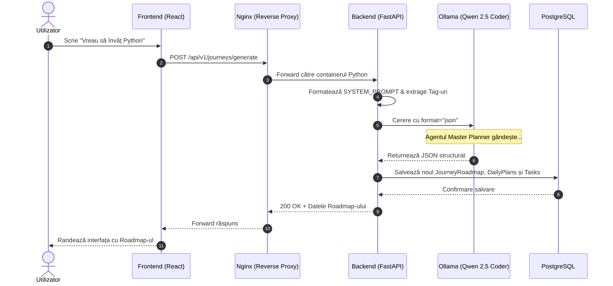
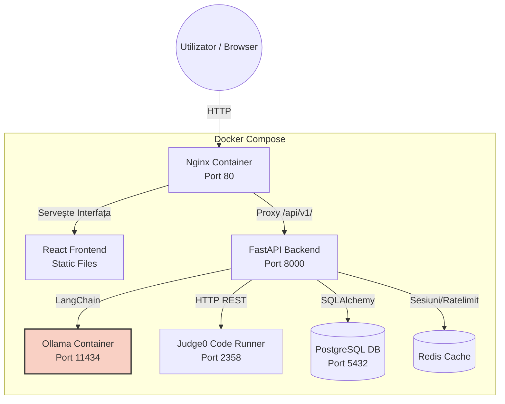
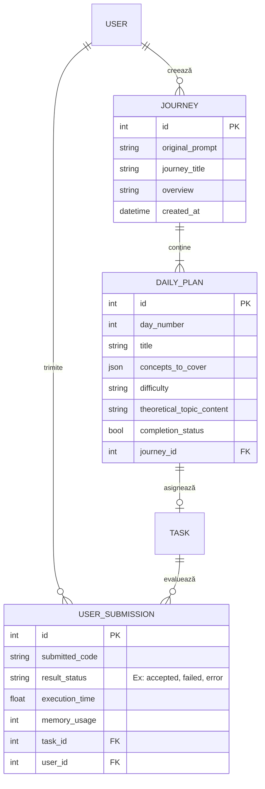

# Larry: AI Coding Coaching Platform

**Version:** 1.1.0

Larry is a next-generation, web-based AI Coding Coaching platform. Designed from scratch using a Multi-Agent System (MAS) and Retrieval-Augmented Generation (RAG), Larry provides users with personalized learning journeys, dynamic curriculum generation, and an isolated, real-time code execution environment. 

This document serves as the official project architecture and documentation.

---

## 🏗 Architecture Overview

The system is designed with a modern decoupled architecture, separating the client interface from the backend API, the AI orchestration layer, and the isolated code evaluation environment.

### Sequence Diagram (Journey Generation)



### Container Architecture



### Entity-Relationship Diagram 



### 1. Hybrid LLM Architecture
Larry uses a cost-effective and highly capable hybrid model strategy:
- **Commercial APIs (e.g., Google Vertex AI / Gemini 2.5 Pro):** Utilized by the Content Creator Agent for processing RAG contexts, generating comprehensive Markdown theory lessons, and executing smart coding problem selections.
- **Local Open Source Models (e.g., Qwen 2.5 Coder via Ollama):** Run locally via Docker to handle structured JSON outputs for the Master Planner, dramatically reducing API costs while maintaining top-tier coding context.

### 2. Multi-Agent System (LangChain)
- **Master Planner:** Analyzes user prompts to generate a structural `Journey` with specific `objectives` and concepts spanning multiple days. Supports dynamic regeneration of the curriculum if the user changes the difficulty level.
- **Content Creator:** Asynchronously fetches RAG context from ChromaDB and generates the theoretical `theoretical_topic_content` and curates specific coding `Tasks` (problems) matching the concepts of the `DailyPlan`.
- **Socratic Tutor:** Acts as a conversational sidekick, reading user submissions and guiding them toward solutions without giving away direct answers.

---

## 💻 Technology Stack

| Component | Technology | Description |
| :--- | :--- | :--- |
| **Frontend** | React (Vite) + Tailwind | UI layer, leveraging `@monaco-editor/react` for the code editor interface. |
| **Backend API** | FastAPI (Python) | High-performance asynchronous REST framework. |
| **ORM & DB** | SQLAlchemy 2.0 | Modern database interaction utilizing `Mapped` and `mapped_column` paradigms. |
| **Relational DB** | PostgreSQL | Primary datastore mapped to port 5440 via Docker Compose. |
| **Vector DB** | ChromaDB | Local vector store for the RAG pipeline to index books/courses. |
| **Caching/Queue** | Redis | To be used for task queues and rapid state caching. |
| **AI Orchestration** | LangChain | Managing agent states, prompts, and vector database interactions. |
| **Code Execution** | Judge0 | Secure, sandboxed code execution engine integrated for evaluating submissions. |

---

## 🚀 Key Features

1. **Dynamic Curriculum Generation**: AI instantly designs a multi-day coding roadmap.
2. **Adaptive Difficulty**: Users can change the difficulty level (Beginner/Intermediate/Advanced) of a journey on-the-fly, triggering the Master Planner to rewrite the curriculum while preserving pedagogical coherency.
3. **In-Browser IDE & Code Execution**: Monaco Editor integrated with a Judge0 backend pipeline allowing users to run Python/C++/JS code against hidden test cases.
4. **Statistics Dashboard**: Visual progress tracking and success rates based on Judge0 "Accepted" submissions vs "Failed" attempts.
5. **PDF Lesson Export**: Automatically compile generated Markdown lessons into premium PDF documents using WeasyPrint for offline reading.
6. **RAG-Powered Content**: Theoretical lessons are generated by synthesizing uploaded course materials via Vector Similarity Search (ChromaDB + Vertex AI Embeddings).

---

## 📂 Project Structure

```text
Larry/
├── backend/
│   ├── app/
│   │   ├── agents/          # Multi-Agent logic (master_planner.py, content_creator.py)
│   │   ├── api/             # REST endpoints (routers) and dependencies
│   │   ├── core/            # Security (JWT, bcrypt) and global config
│   │   ├── crud/            # Database access layer
│   │   ├── db/              # SQLAlchemy session and initialization
│   │   ├── models/          # SQLAlchemy 2.0 ORM Entities
│   │   ├── schemas/         # Pydantic v2 Data Validation models
│   │   └── services/        # RAG pipeline, Judge0 execution, PDF generation
│   ├── main.py              # FastAPI application entry point
│   └── requirements.txt     # Python dependencies
├── frontend/                # React (Vite) Client Application
│   ├── src/
│   │   ├── components/      # RoadmapDisplay, Sidebar, StatisticsDashboard, Workspace
│   │   ├── pages/
│   │   ├── services/        # API interceptors and axios setup
│   │   └── App.jsx          # Main Routing Implementation
│   └── package.json
├── infrastructure/
│   └── judge0/              # Configuration for Judge0 isolation
└── docker-compose.yml       # Orchestration for PostgreSQL, ChromaDB, Redis, Ollama, Judge0
```

---

## 🔄 Database Migrations (Alembic)

The project uses [Alembic](https://alembic.sqlalchemy.org/) to handle schema changes. It is fully integrated with our SQLAlchemy 2.0 models and automatically resolves the database URL.

All migration commands must be run from inside the `backend/` directory with the virtual environment activated:

```bash
# 1. Generate a new migration script automatically after changing models in app/models/
alembic revision --autogenerate -m "description_of_changes"

# 2. Apply the migration to the database
alembic upgrade head
```

---

## 🧠 RAG Ingestion Pipeline (Vertex AI)

The core RAG (Retrieval-Augmented Generation) ingestion module has been fully implemented. It processes uploaded PDFs asynchronously without blocking the FastAPI event loop.

- **Native Vision Extraction**: Uses the `google-cloud-aiplatform` SDK to send raw PDF bytes to Gemini as inline multimodal data, enforcing strict Markdown output with detailed visual descriptions.
- **Smart Chunking**: LangChain's `MarkdownHeaderTextSplitter` semantically segments the text.
- **Vector Storage**: Uses Google's Vertex Embeddings (`text-embedding-004`) to embed the chunks and stores them in our Dockerized ChromaDB instance (`larry_knowledge_base` collection).

**Google Cloud Setup Requirement:**
To run the RAG pipeline locally, you must authenticate with Google Cloud using Application Default Credentials (ADC):
```bash
gcloud auth application-default login
gcloud config set project [YOUR_GCP_PROJECT_ID]
```

---

## 🧪 Testing & CI/CD Pipeline

The backend features a robust testing suite using `pytest` and `pytest-asyncio` with coverage tracking.

- **GitHub Actions**: A `.github/workflows/tests.yml` pipeline runs automatically on all pushes and Pull Requests to the `main` branch.
- **LLM-as-a-Judge**: We use an advanced "Golden Dataset" strategy inside `tests/agents/test_agent_evals.py` to probabilistically evaluate the AI agents.
- **Mocking Strategy**: External services like Judge0 and Vertex AI are heavily mocked during CI to ensure deterministic tests and fast execution.

---

## ✅ Current Status

The core platform is fully operational and functional:

- **AI Agents**: Master Planner (Ollama/Qwen2.5) and Content Creator (Vertex AI) are fully implemented and integrated into the workflow.
- **Code Execution Integration**: Judge0 is fully connected. The `UserSubmission` endpoints evaluate actual code against hidden test cases and return robust execution metadata.
- **Frontend UI Expanded**: The React dashboard now visualizes Journeys via `RoadmapDisplay`, supports the Monaco Code Editor Workspace, provides a Socratic Tutor chat interface, and aggregates user metrics in the new `StatisticsDashboard`.
- **Advanced Features**: Users can change curriculum difficulty dynamically, export progress to PDF, and review execution history natively.
